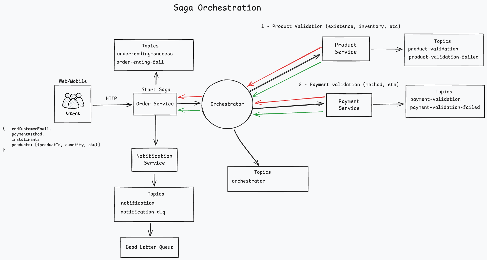

# Saga Orchestrator Pattern Implementation

### About

This project is a **sample implementation of the Saga Orchestrator Pattern**.  
It demonstrates how to coordinate distributed transactions across multiple microservices such as Order, Product, and
Payment, through an orchestration-based saga flow.

### Tech stack

- Kafka
- Postgres
- Docker
- Java 17
- Spring Boot

> ⚠️ This is a model project for study and experimentation purposes.  
> It can be improved with advanced features such as message deduplication, retry strategies, and stronger error
> handling.

### Architecture Design

